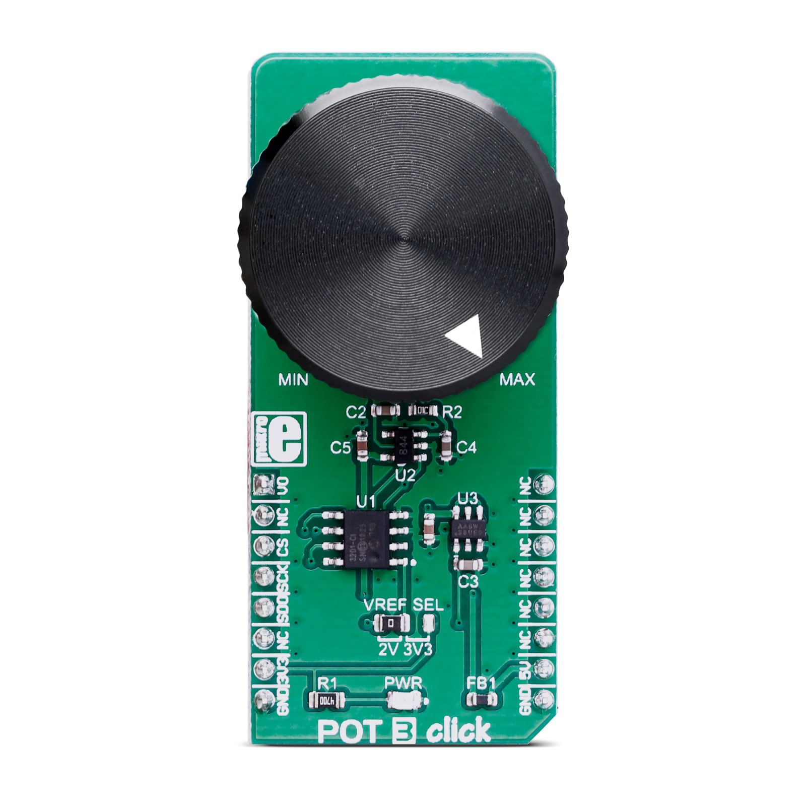
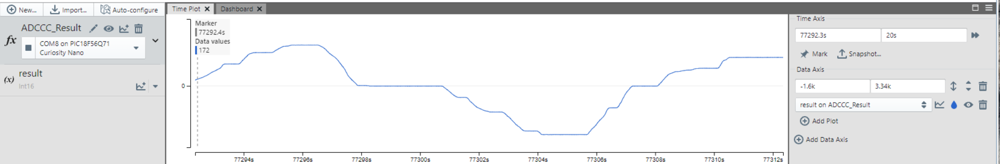
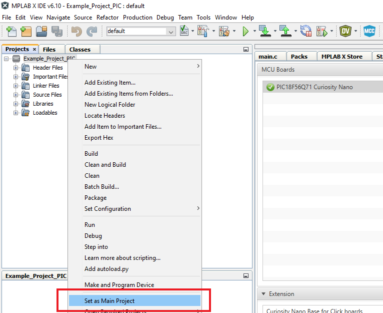
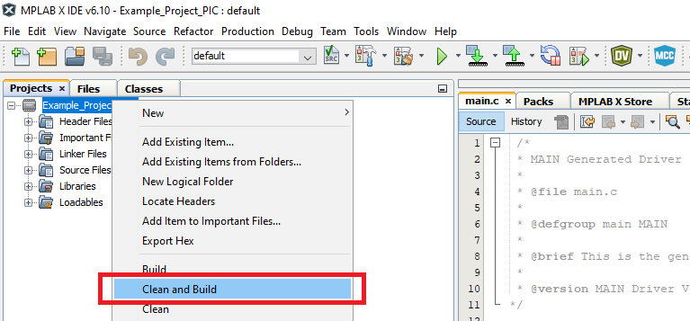
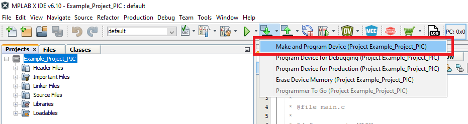

# Analog-to-Digital Converter with Computation (ADCC) and Context Switching — Differential Reading Using PIC18F56Q71 Microcontroller with MCC Melody

This code example demonstrates how to perform a differential coversion using the Analog-to-Digital Coverter with Computation (ADCC) and Context Switching and visualize the voltage difference of two input channels using the Data Visualizer tool. The application starts with the initialization of the ADCC with Context Switching and UART peripherals, and then a conversion is performed every 10 ms. The conversion result is sent via serial communication using the UART peripheral in the Data Visualizer format, in which a real-time plot is displayed.

## Related Documentation

More details and code examples on the AVR64DD32 can be found at the following links:

- [PIC18F56Q71 Product Page](https://www.microchip.com/en-us/product/PIC18F56Q71)
- [PIC18F56Q71 Code Examples on GitHub](https://github.com/orgs/microchip-pic-avr-examples/repositories?q=pic18f56q71&type=all&language=&sort=)

## Software Used

- [MPLAB® X IDE](http://www.microchip.com/mplab/mplab-x-ide) v6.05 or newer
- [MPLAB® X IPE](https://www.microchip.com/en-us/tools-resources/production/mplab-integrated-programming-environment) v6.05 or newer
- [MPLAB® XC8](http://www.microchip.com/mplab/compilers) v2.40 or newer
- [PIC18F-Q Series Device Pack](https://packs.download.microchip.com/) v1.15.243 or newer

## Hardware Used

- The PIC18F56Q71 Curiosity Nano Development Board is used as a test platform:
   

- Curiosity Nano Adapter:
   

- POT 3 CLICK Board:
   

 

## Operation

To program the Curiosity Nano board with this MPLAB® X project, follow the steps provided in the [How to Program the Curiosity Nano Board](#how-to-program-the-curiosity-nano-board) chapter.  

## Setup

The following configurations must be made for this project:

- System clock is configured at 64 MHz – ADCRC Oscillator enabled
- ADCC with Content Switching:
  - Input Configuration: Differential mode
  - Result Format: Right justified, two's complement
  - VDD: 3.3 V
  - Clock Selection: ADCRC
  - Enable Context 1:
    - Positive Channel Selection: ANA2
    - Positive Voltage Reference: VDD
    - Negative Channel Selection: ANA1
    - Negative Voltage Reference: VSS
    - Operating Mode Selection: Basic mode
    - Double Sampling
- UART2:
  - 115200 baud rate
  - 8 data bits
  - No parity bit
  - 1 Stop bit
  - RX and TX pins enabled (RB5 and RB4)

| Pin | Configuration  |
| :-: | :------------: |
| RA1 |  Analog input  |
| RA2 |  Analog input  |
| RB4 | Digital output |
| RB5 | Digital input  |

 

## Demo

To visualize the ADCC with Content Switching readings in a graphical format use the Data Visualizer time plot.

Follow the procedure below to open the Graph/Time plot in Data Visualizer:

- Open the Data Visualizer tool, available as a plugin in MPLAB® X IDE

- Click on **Connections** > **Serial Ports**

- Open the COMx Settings window corresponding to the port that your device is connected to. Set the Baud Rate to **115200**.

- Click **Play** to start streaming

- Click **Variable Streamer** > **New...**

- Add new variables as shown in the image below and click **Save**
   

- Select the source of the plot as COMx port

- Click **Plot all variables**
   

This method determines if the result is positive or negative.

**Note**: The COM port number can differ depending on the port availability.
 

## Summary

This code example shows how to configure the ADCC with Context Switching using the MPLAB® Code Configurator and demonstrates the use of the peripheral by sending the result via the UART interface and plotting it with Data Visualizer.
  
[Back to Top](#analog-to-digital-converter-with-computation-adcc-and-context-switching--differential-reading-using-pic18f56q71-microcontroller-with-mcc-melody)

## How to Program the Curiosity Nano Board

This chapter demonstrates how to use the MPLAB® X IDE to program a PIC® device with an Example_Project.X. This is applicable to other projects.

1.  Connect the board to the PC.

2.  Open the Example_Project.X project in MPLAB® X IDE.

3.  Set the Example_Project.X project as main project.
     Right click the project in the **Projects** tab and click **Set as Main Project**.
     

4.  Clean and build the Example_Project.X project.
     Right click the **Example_Project.X** project and select **Clean and Build**.
     

5.  Select **PICxxxxx Curiosity Nano** in the Connected Hardware Tool section of the project settings:
     Right click the project and click **Properties**.
     Click the arrow under the Connected Hardware Tool.
     Select **PICxxxxx Curiosity Nano** (click the **SN**), click **Apply** and then click **OK**:
     

6.  Program the project to the board.
     Right click the project and click **Make and Program Device**.
     

 

- [Back to Setup](#setup)
- [Back to Demo](#demo)
- [Back to Summary](#summary)
- [Back to Top](#analog-to-digital-converter-with-computation-adcc-and-context-switching--differential-reading-using-pic18f56q71-microcontroller-with-mcc-melody)
